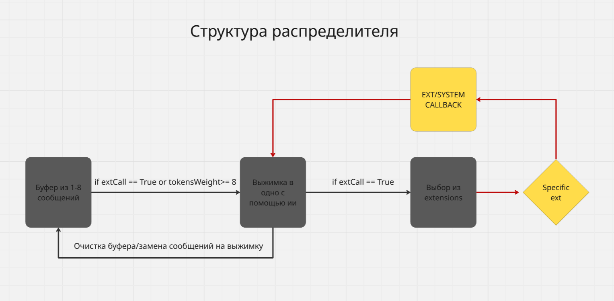
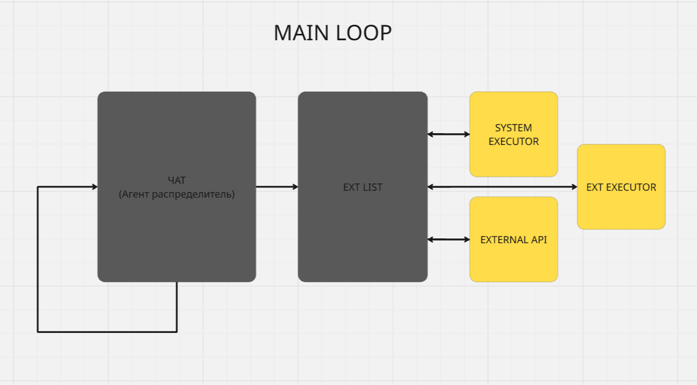

# 🧠 Voice AI System (GPT/DeepSeek PC Control)

## 📌 Overview
Проект представляет собой голосового ИИ-агента, который обрабатывает пользовательские команды и управляет компьютером через комбинацию:

- моделей GPT/DeepSeek (LLM),
- системы extensions (внешние и системные модули),
- механизма вызова системных команд,
- callback-логики,
- постоянного основного цикла (MAIN LOOP).

Цель — создать модульную структуру, в которой ИИ может:

- понимать голосовые команды,
- решать, какое действие предпринять,
- вызывать необходимые расширения (extensions),
- выполнять настоящие системные операции на ПК,
- отправлять результаты обратно пользователю.

---

# 📷 MAIN LOOP


****

Основной цикл отвечает за:

- приём пользовательских команд,
- работу агента-распределителя (dispatcher agent),
- маршрутизацию запросов к EXT LIST,
- выполнение системных и внешних API команд,
- возврат результата в чат-модуль.

## 🔁 Основной цикл содержит 4 ключевых компонента:

### **1. CHAT (Агент распределитель)**
- получает сообщения,
- анализирует намерение,
- принимает решение: оставить ответ на себя или вызвать extension,
- обрабатывает буфер сообщений.

### **2. EXT LIST**
Список доступных extensions:

- системные,
- внешние API,
- кастомные модули.

### **3. SYSTEM EXECUTOR**
Выполняет низкоуровневые действия:

- управление звуком,
- клавиши,
- запуск приложений,
- управление окнами,
- PowerShell/WinAPI.

### **4. EXTERNAL API**
Взаимодействие с внешними сервисами:

- DeepSeek API,
- OpenAI API,
- Telegram API,
- браузерные API.

---

# 🧩 Структура распределителя


Распределитель управляет логикой вызова extensions и обработкой сообщений.  
Он состоит из:

## 🟦 **Буфер сообщений (1–8)**  
Хранит последние сообщения от пользователя и агента.

### Триггеры выжимки:
- `extCall = True`
- или `tokensWeight >= 8`

Буфер позволяет:

- сохранять краткий контекст,
- оптимизировать расходы токенов,
- избегать "разрешений" в длинных диалогах.

---

## 🟨 **Выжимка (Compression)**  
Происходит с помощью LLM.

**Задачи:**

- сжать историю до одного смыслового блока,
- уменьшить токены,
- передать extension только чистый смысл.

После выжимки:

- буфер очищается,
- вставляется краткое summary.

---

## 🟧 **Выбор Extension**  
Если `extCall = True`, распределитель определяет:

- какой модуль должен быть вызван,
- какой тип действия нужно выполнить,
- требует ли ситуация системного или внешнего вызова.

---

## 🟨 EXT/SYSTEM CALLBACK  
После выполнения extension:

- результат возвращается обратно в распределитель,
- формируется ответ для пользователя,
- буфер обновляется.

---

# 🔧 Execution Pipeline

```
User → Dispatcher → Decision → (optional) Compress → Extension → Callback → Chat → User
```

---

# 🎤 Возможности бота

### 🎵 Управление ПК:
- громкость,
- музыка,
- системные кнопки,
- управление окнами.

### 🌍 Внешние API:
- Telegram,
- браузер,
- GPT/DeepSeek,
- сервисы погоды.

### 🤖 AI-интеллект:
- поддержка короткой и длинной памяти,
- анализ намерений,
- контекстное принятие решений,
- сжатие диалогов.

---
